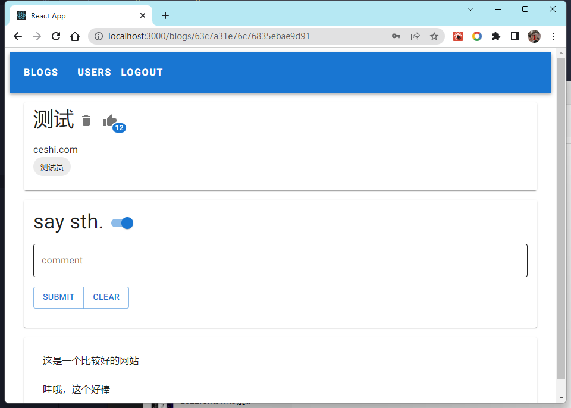
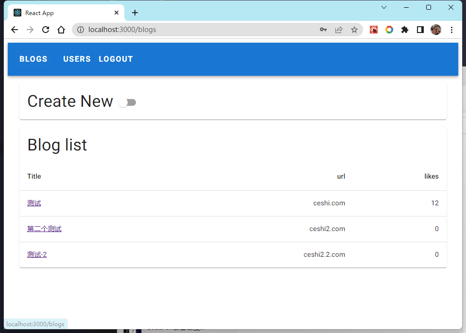
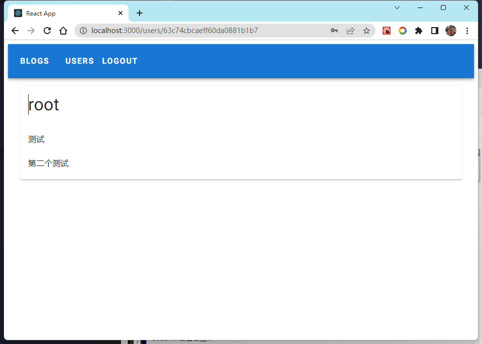
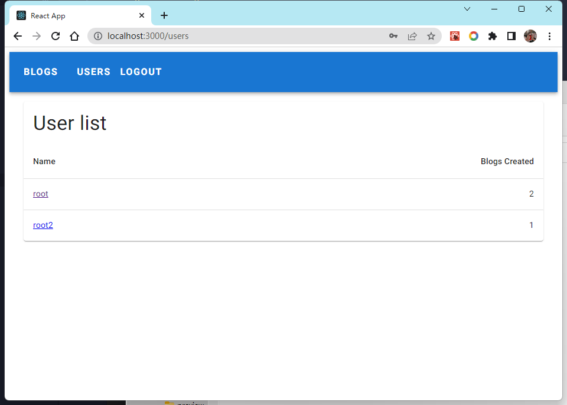
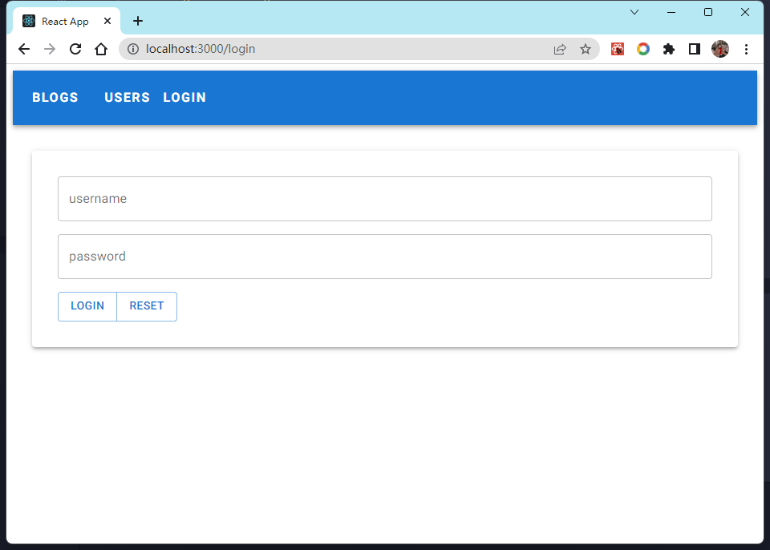

# Getting Started Blog list

I have build the app and backend in different directory, you can show the backend suffixes.

## Available Scripts

In the project directory, you can run:

### `npm start`

Runs the app in the development mode.\
Open [http://localhost:3000](http://localhost:3000) to view it in your browser.

### `npm dev`

Runs the backend in the development mode.\
Open [http://localhost:3003/api](http://localhost:3003/api) to view it in your browser.

## Preview

### Blog

### User

### Login

